# KBS+ (KBS My K) iOS — 레거시 Objective-C 앱의 Swift 네이티브 전면 재설계

> Objective-C 기반 JavaScript 브릿지(WebView) 구조의 레거시 KBS 미디어 앱을, 3년 4개월에 걸쳐 Swift 클린 아키텍처 네이티브 앱으로 전면 재작성하고 리드 개발자로 운영·고도화한 프로젝트.

---

## 1. 프로젝트 개요

| 항목 | 내용 |
|---|---|
| 서비스 | KBS+ / KBS My K — KBS 공식 OTT·실시간 스트리밍 iOS 앱 (App Store 운영 중) |
| 기간 | 2023.03 ~ 2026.06 (3년 4개월, 진행 중) |
| 역할 | iOS 리드 개발자 — 아키텍처 설계 · 핵심 기능 구현 · 릴리스 운영 단독 담당 |
| 규모 | 누적 약 2,363 커밋, 본인 약 1,664 커밋(약 70%) 주도 |
| 코드베이스 | Swift 408개 파일 · 약 55,000 라인 (Objective-C / JS 0개 — 100% 네이티브 Swift 전환 완료) |
| 플랫폼 | iOS 14 ~ iOS 26, iPhone · iPad 유니버설 |

---

## 2. Before / After

**Before — Objective-C + JavaScript 브릿지(WebView) 하이브리드**

- 화면 로직이 웹(HTML/JS)과 네이티브(Objective-C 셸)에 분산, 둘 사이를 JS 브릿지로 연결
- 유지보수·디버깅 난이도 높음, 네이티브 성능·접근성·플랫폼 신기능 대응에 구조적 한계

**After — 100% Swift 네이티브 + 클린 아키텍처**

- 기능별 모듈 분리, 모던 동시성·반응형 패턴 전면 도입
- async/await 84파일, Combine 59파일, 프로토콜 추상화 68개, CompositionalLayout 20파일 규모 적용
- 단순 포팅이 아니라 화면 단위 점진 전환으로 **App Store 운영 중단 없이** 3년에 걸쳐 레거시 제거

---

## 3. 아키텍처 — Clean Architecture 4계층

의존성이 항상 중심(Domain)을 향하도록 설계. Presentation·Infrastructure가 Domain에 의존, Domain은 어떤 프레임워크에도 비의존.

- **Application Layer** — App / Scene Delegate, 앱 구성(Config).
- **Presentation Layer** — Home · OnAir · VOD · KIDS · EASY · 명품관 등 화면. UIKit · MVVM · Combine · CompositionalLayout 기반.
- **Domain Layer** — Entities · UseCases. 프레임워크에 의존하지 않는 순수 비즈니스 로직.
- **Infrastructure Layer** — PlusNetwork(자체 네트워킹) · Google Cast · Analytics · WebView · Crypto · MinimizePlayer 등.

---

## 4. 기술적 하이라이트

- **레거시 하이브리드 앱의 네이티브 전면 재작성 리드** — Objective-C/JS 브릿지 구조를 Swift 클린 아키텍처로 화면 단위 점진 마이그레이션. App Store 운영을 멈추지 않고 3년에 걸쳐 완료.
- **자체 네트워킹 레이어(PlusNetwork) 설계** — `URLInfo` / `RequestInfo` / `PlusNetworkUsecase` 조합의 타입 안전한 선언적 API 패턴을 직접 설계. 엔드포인트를 값 타입으로 정의하고 요청을 use-case 단위로 캡슐화해 보일러플레이트를 제거.
- **반응형·동시성 아키텍처 도입** — Combine 단방향 데이터 흐름과 async/await 비동기 처리로 콜백 중첩을 제거. 네트워크 중복 호출 방지를 boolean 플래그가 아닌 `Task?` 레퍼런스로 표현하는 등 상태를 타입으로 모델링.
- **iPad 적응형 레이아웃 / iOS 26 신규 디자인 대응** — 회전·창 크기에 따라 세로 스택과 좌우 분할을 동적 전환하는 반응형 시스템 구축. iOS 26 새 내비게이션 appearance에 맞춰 `UINavigationBarAppearance` 기반으로 내비게이션 바 재설계.
- **테스트 가능성 개선** — 네트워크 transport seam을 주입 가능하게 리팩터링. Service 계층에 `~Provider` 프로토콜 컨벤션을 도입해 단위 테스트 가능한 구조로 전환.
- **접근성·실시간 기능** — VoiceOver, thread-safe 실시간 채팅, Google Cast, PIP, 시청 히스토리, 유니버설 링크 딥링킹, Apple 로그인, 간편모드·키즈모드.

---

## 5. 기술 스택

- **언어/프레임워크** — Swift 5, UIKit, Combine, Swift Concurrency(async/await), AVFoundation
- **아키텍처** — Clean Architecture, DDD, MVVM, Protocol-Oriented Programming
- **UI** — UICollectionViewCompositionalLayout, Diffable DataSource, Auto Layout, iPad 적응형, iOS 26 신규 디자인
- **미디어** — AVPlayer, JWPlayer(교체 중), Google Cast SDK, Google IMA, PIP
- **인프라** — 자체 네트워킹 레이어(PlusNetwork), CocoaPods, Firebase(Analytics·Push), Kingfisher, 유니버설 링크, Apple Sign In
- **품질** — 단위 테스트 seam 주입, UITest 기반 QA 시나리오, 강제 언래핑·boolean 플래그 지양 등 자체 코드 규약

---

## 6. Before & After

> 좌: 레거시(Obj-C · WebView, 라이트 테마 · 5탭) / 우: 신규 네이티브(Swift, 다크 테마 · 4탭)
> 동일 화면을 나란히 비교. 이미지 경로는 이 문서(`portfolio/`) 기준 상대경로.

<table>
  <thead>
    <tr>
      <th width="34%">Before — 레거시</th>
      <th width="66%">After — 신규 네이티브</th>
    </tr>
  </thead>
  <tbody>
    <!-- 홈 -->
    <tr>
      <td align="center">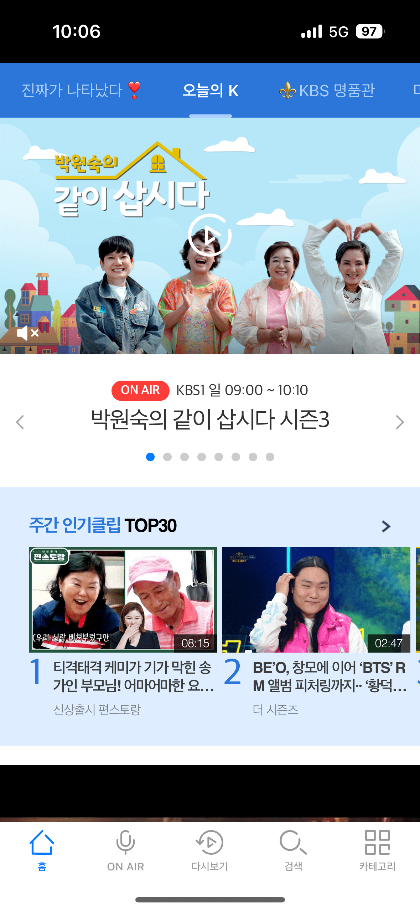</td>
      <td align="center">
        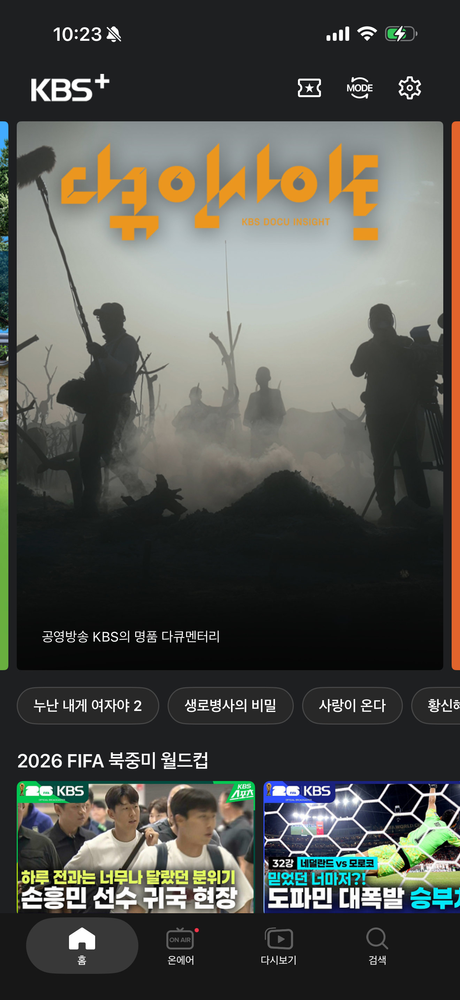
        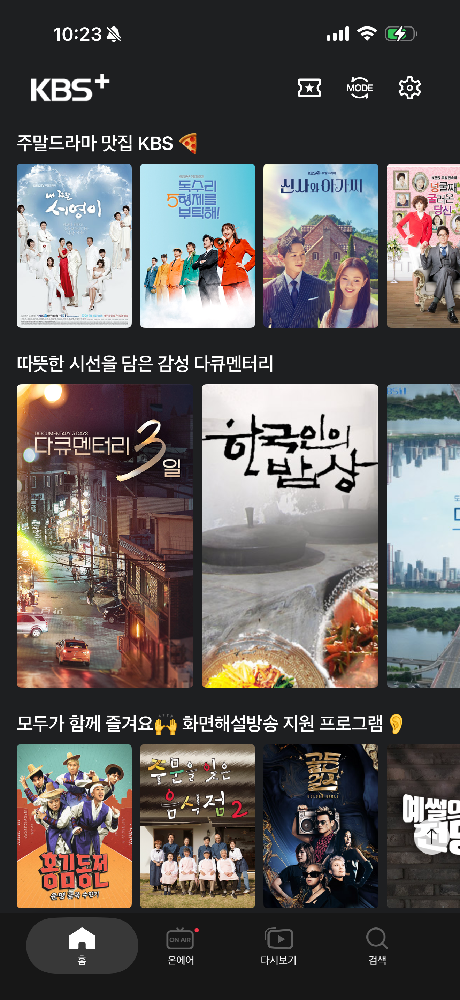
      </td>
    </tr>
    <tr>
      <td align="center"><b>홈</b></td>
      <td align="center"><b>홈</b></td>
    </tr>
    <!-- 온에어 / 실시간 -->
    <tr>
      <td align="center">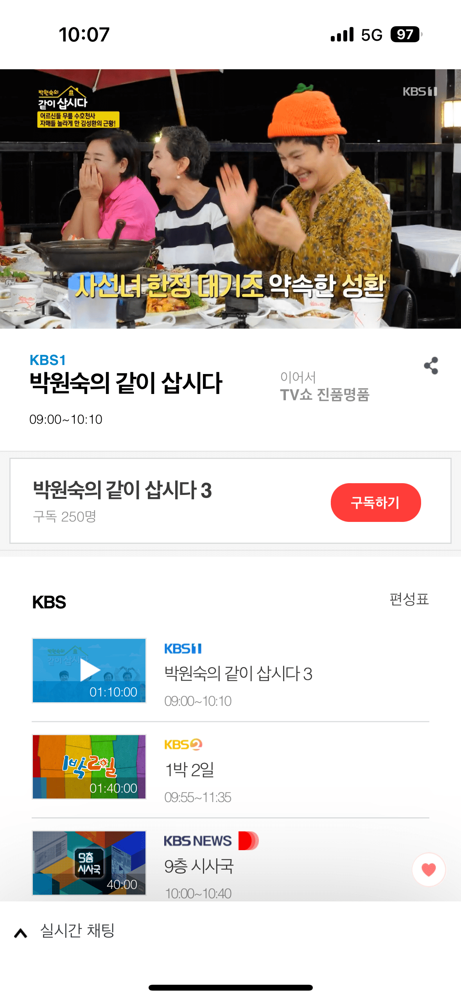</td>
      <td align="center">
        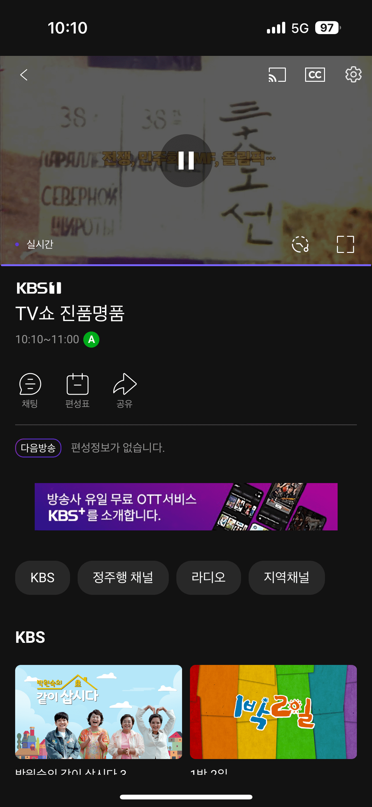
        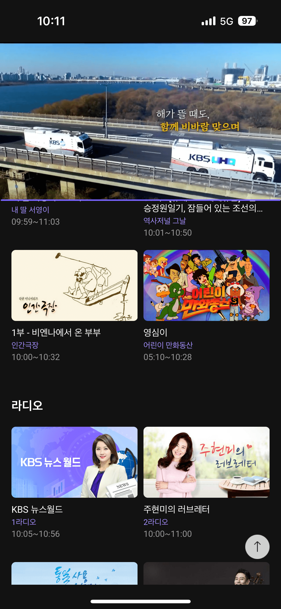
      </td>
    </tr>
    <tr>
      <td align="center"><b>온에어 · 실시간</b></td>
      <td align="center"><b>온에어 · 실시간</b></td>
    </tr>
    <!-- 다시보기 / VOD -->
    <tr>
      <td align="center">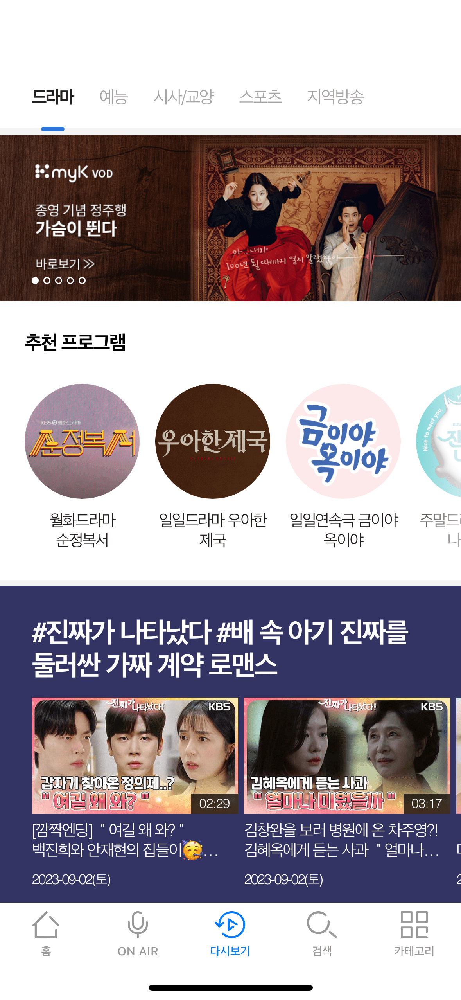</td>
      <td align="center">
        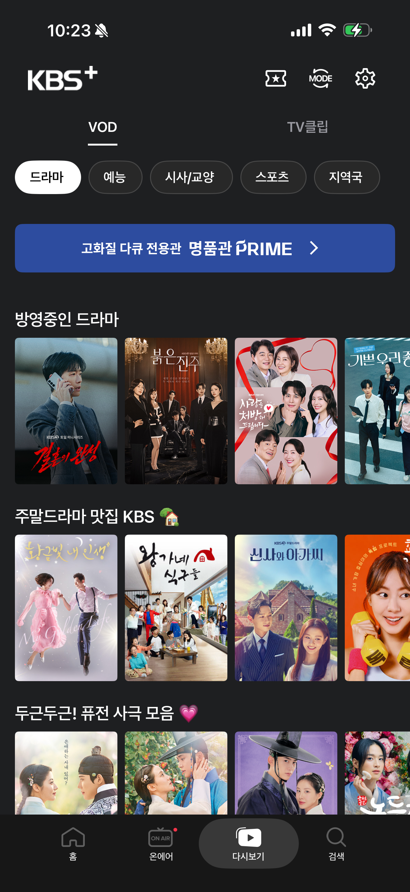
        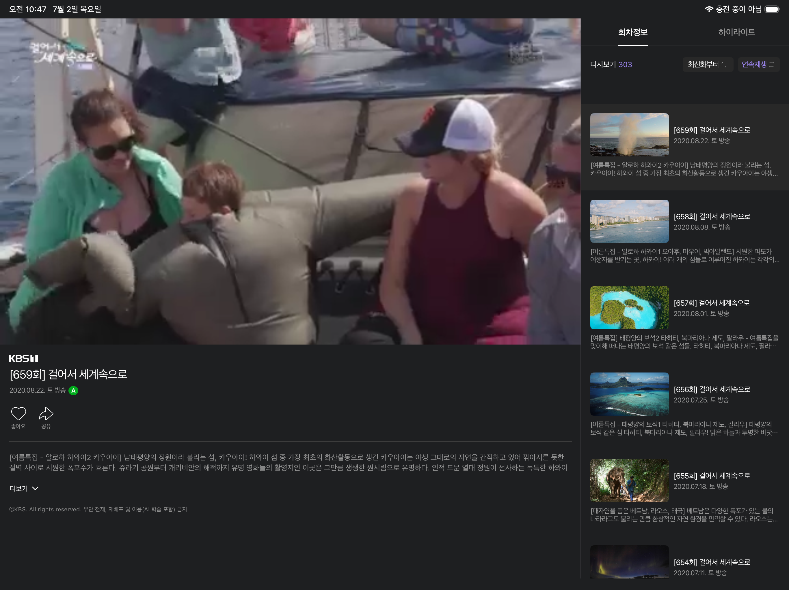
      </td>
    </tr>
    <tr>
      <td align="center"><b>다시보기 · VOD</b></td>
      <td align="center"><b>다시보기 · VOD</b> 하단: iPad 가로 적응형 split 재생</td>
    </tr>
    <!-- 검색 -->
    <tr>
      <td align="center">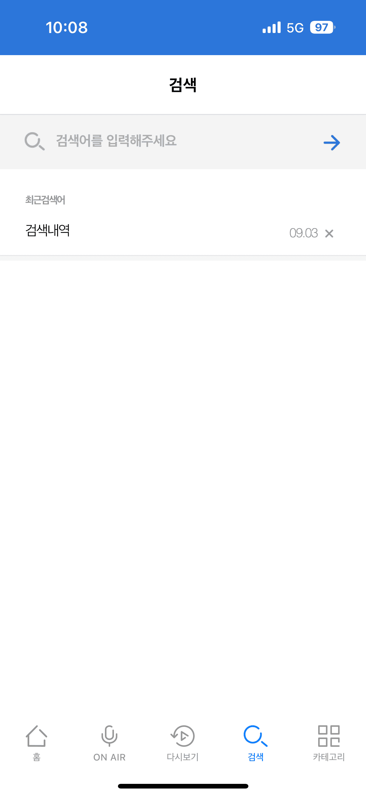</td>
      <td align="center">
        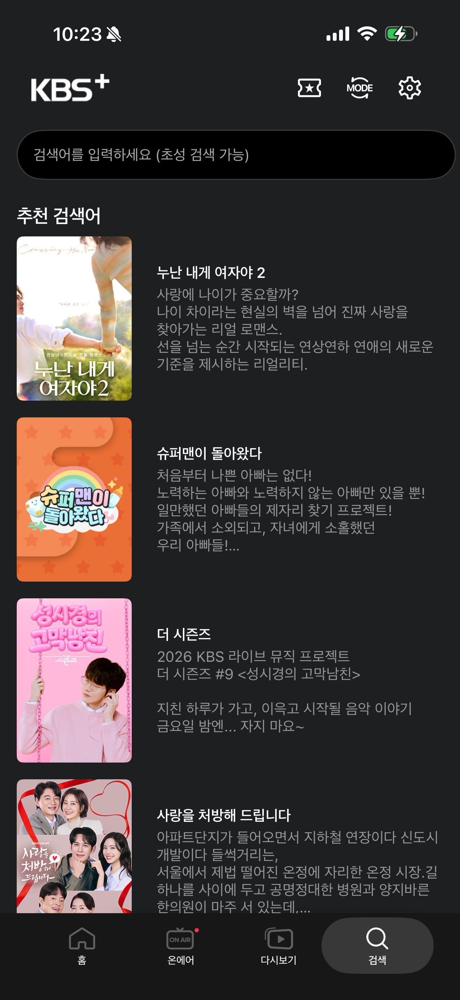
        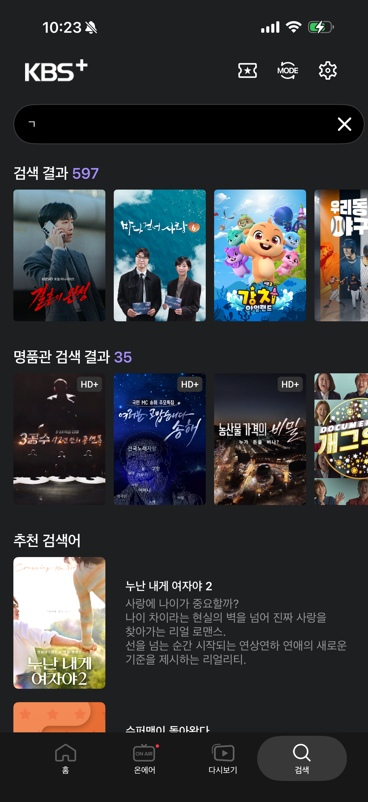
      </td>
    </tr>
    <tr>
      <td align="center"><b>검색</b></td>
      <td align="center"><b>검색</b></td>
    </tr>
  </tbody>
</table>

