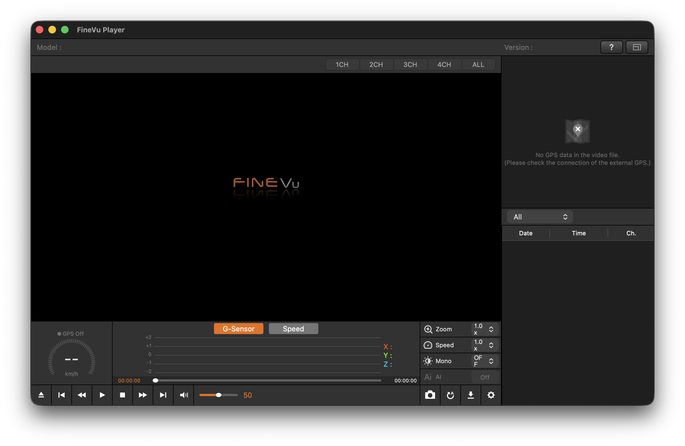
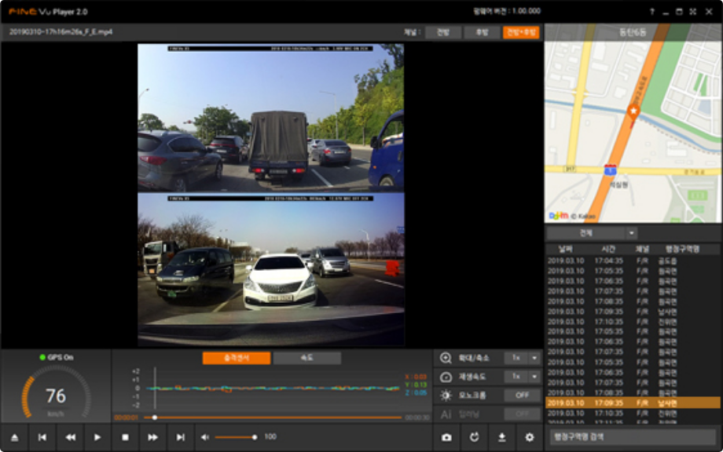
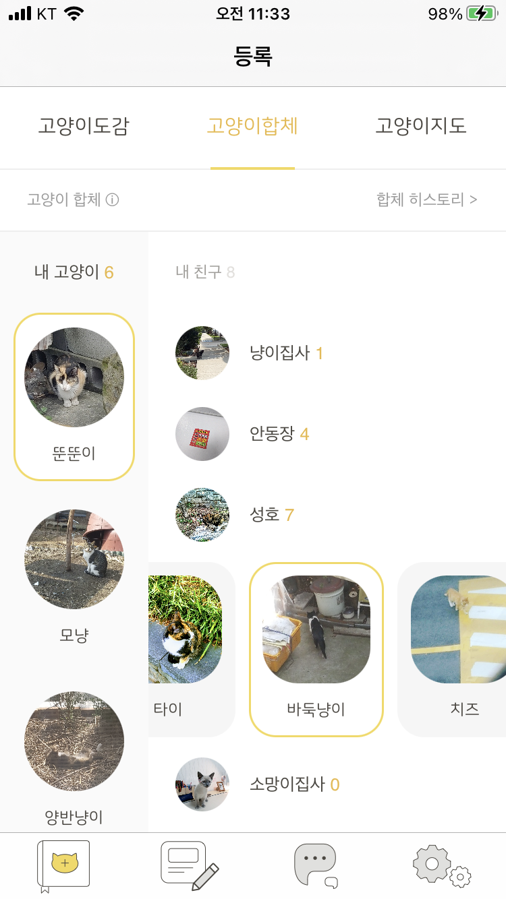
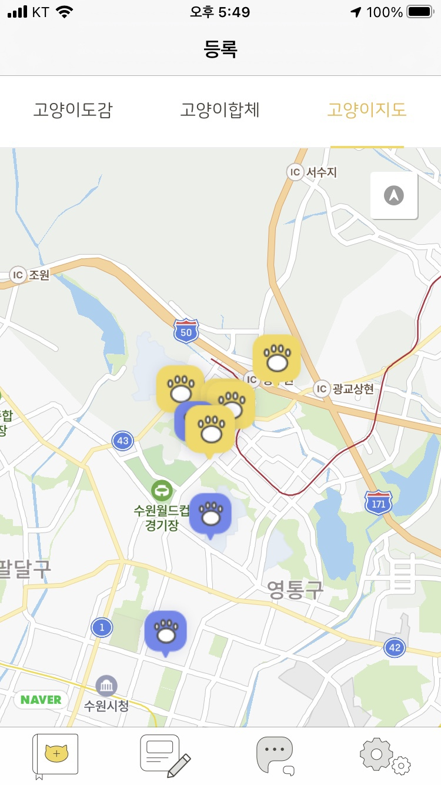

# 포트폴리오 — 이모션웨이브

> 3인 규모 초기 멤버로 합류(2019.01 ~ 2021.11) → 30인 규모 성장. iOS·macOS·Web·IoT 등 다중 플랫폼 클라이언트를 단독으로 설계·구현. 아래는 대표 프로젝트 모음.
> (KBS+ 프로젝트는 별도 문서: `KBSPlus_Portfolio.md`)

---

## 1. FineVuPlayer — 블랙박스 영상 플레이어 (macOS)

| 항목 | 내용 |
|---|---|
| 플랫폼 | macOS (AppKit) |
| 역할 | 설계·구현 |
| 기술 | AppKit, FFmpeg(Demuxing/Decoding), Core Animation, AVFoundation |

- **블랙박스 전용 영상 플레이어를 macOS 네이티브로 구현.** 다채널(1~4CH) 동시 재생, 전/후방 화면 동기 재생.
- **FFmpeg 직접 연동.** Demuxing·Decoding을 직접 다뤄 블랙박스 고유 컨테이너·코덱을 재생. 표준 플레이어로 열리지 않는 포맷 대응.
- **커스텀 데이터트랙 기반 Core Animation 차트.** 영상에 동기화된 G-Sensor(X/Y/Z 가속도)·속도 그래프를 프레임 진행에 맞춰 실시간 렌더링.
- **부가 기능.** 재생 배속, 구간 탐색, 채널 전환, 캡처, GPS 좌표 표시(지원 파일 한정).

<table>
  <tr>
    <td align="center" width="50%"></td>
    <td align="center" width="50%"></td>
  </tr>
  <tr>
    <td align="center"><b>macOS (AppKit)</b></td>
    <td align="center"><b>Windows — 재생 · 지도 · G-Sensor</b></td>
  </tr>
</table>

---

## 2. 오냥가냥 (InOutCat) — 위치 기반 길고양이 피드 SNS (iOS)

| 항목 | 내용 |
|---|---|
| 플랫폼 | iOS |
| 역할 | 설계·구현 |
| 기술 | Core Location, 지도(네이버 지도), Swift |

- **위치 기반 길고양이 기록·공유 SNS.** 발견한 길고양이를 사진·위치와 함께 등록하고 이웃과 공유.
- **고양이 도감 / 합체 / 지도 구성.** 내 고양이·친구의 고양이 목록을 관리하고, 지도 위에 발견 위치를 마커로 표시.
- **Core Location 기반 지도 클러스터링.** 다수 마커를 지역 단위로 묶어 표시, 위치 기록 수집·시각화.

<table>
  <tr>
    <td align="center" width="50%"></td>
    <td align="center" width="50%"></td>
  </tr>
  <tr>
    <td align="center"><b>등록 · 고양이 목록</b></td>
    <td align="center"><b>고양이 지도</b></td>
  </tr>
</table>

---

## 3. AQUABED — 온수매트 BLE 기기 연동 IoT 앱 (iOS)

| 항목 | 내용 |
|---|---|
| 플랫폼 | iOS |
| 역할 | 단독 설계·구현 |
| 기술 | Core Bluetooth(BLE), Swift |

- **온수매트 하드웨어와 BLE 연동.** 온도·모드·타이머 등 기기 상태를 앱에서 제어·모니터링.
- **20바이트 BLE 패킷 프로토콜 설계·구현.** 기기와 주고받는 커스텀 패킷 구조를 정의하고 파싱·검증 로직 구현.

---

## 4. KY 기기인증 — 노래방 반주기 펌웨어 인증 (iOS · 엔터프라이즈)

| 항목 | 내용 |
|---|---|
| 플랫폼 | iOS (엔터프라이즈 배포) |
| 역할 | 단독 개발 |
| 기술 | Core Bluetooth, Objective-C → Swift 마이그레이션 |

- **금영(KY) 노래방 반주기 펌웨어 업데이트 인증 앱.** 현장 기사가 기기와 연결해 펌웨어 인증·업데이트 수행.
- **Objective-C 레거시를 Swift로 마이그레이션.** 기존 코드베이스를 점진 전환하며 기능 유지.

---

## 5. 현대NGV Softeer — 채용 코딩테스트 내 화상 기능 (Web)

| 항목 | 내용 |
|---|---|
| 플랫폼 | Web (프런트엔드) |
| 역할 | 화상 기능 구현 |
| 기술 | WebRTC(Janus), JavaScript |

- **채용 코딩테스트 플랫폼 내 화상 감독 기능.** 응시자 화면·카메라를 실시간 공유.
- **WebRTC(Janus) 기반 다중 화면 공유.** 다자 연결 시그널링·스트림 관리 구현.

---

*본 문서 이미지는 실제 프로젝트 산출물 캡처.*
